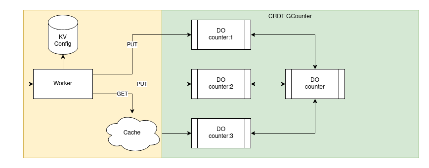

# GCounter

[G-Counter definition](https://en.wikipedia.org/wiki/Conflict-free_replicated_data_type#G-Counter_(Grow-only_Counter))

## API
`GET gcounter.broswen.com/{key}`

Returns the counter value for `{key}`

`PUT gcounter.broswen.com/{key}`

Increments the counter for `{key}`

`/?dump={id}`

Returns the raw gcounters json from `{id}` for debugging

## DO API

`GET /id:#/{key}`

Returns the counter value for `{key}`

`PUT /id:#/{key}`

Increments the counter for `{key}`

`PATCH /id:#`

Sends local state to be merged with the remote state. Then receives the remote state and merges with local state